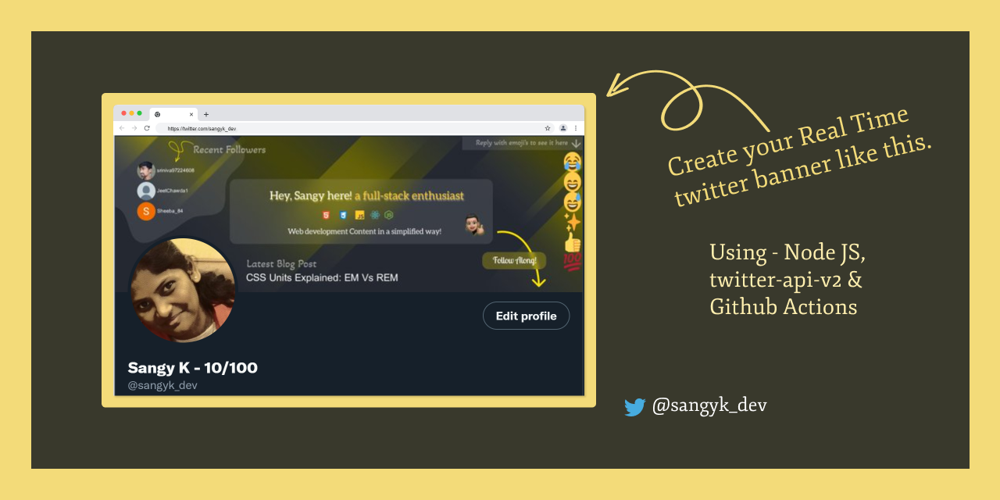
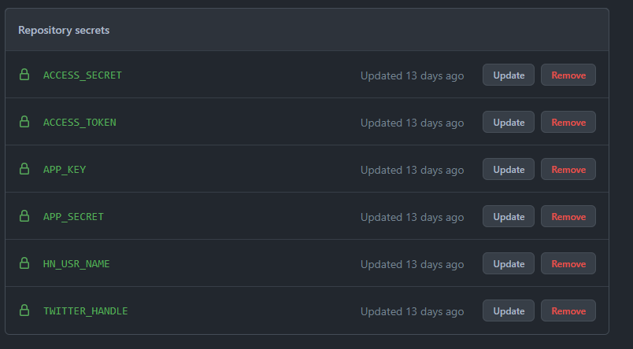

# Chirp-Chirp: A Real-time Twitter Banner

<center>


### This is my little experiment while exploring Twitter API.  
[Follow  + Reply with Emoji's to my latest tweets/replies to see it live here!](https://twitter.com/sangyk_dev).
</center>   
   

#
## Thanks to these Guys!
Inspired from these guys post/work, I tried exploring Twitter API resulting in this experiment.  
* [Tony Dinh](https://twitter.com/tdinh_me) - His Emoji Banner
* [Chris Bongers](https://twitter.com/DailyDevTips1) - His Blog post on Dynamic twitter header
#
## What to expect in this Banner?
1. Update your last 3 followers.
2. Latest Blog Post title from hashnode Blog post.
3. Display the Emoji's from the last 25 replies to my tweets/replies.
#
## What is used to make this happen?
* Node JS
* [node-twitter-api-v2](https://github.com/PLhery/node-twitter-api-v2) for accessing Twitter API v2 & V1.
* [Axios](https://www.npmjs.com/package/axios), a promise based HTTP client.
* [Twitter Emoji](https://www.npmjs.com/package/twemoji), a standard Unicode emoji library.
* [JIMP](https://www.npmjs.com/package/jimp) & [Merge Img](https://www.npmjs.com/package/merge-img), for Image processing.
#
## How this Script works?
1. Initialise the twitter client.
2. Fetch the Emoji
   * Get the latest 25 replies from the Mention Timeline.
   * Filter the last 10 Emojis from the text
   * Create a 'emoji.png' with emoji's ordered vertically.
3. Fetch the latest blog post title from Hashnode GraphQL API.
4. Fetch the last 3 twitter followers image & handle.
5. Put everything into the banner. 'banner.png' -> 'finalBanner.png'
#
## How to Setup & Run this Script?
Apply for [Twitter Developer's Account](https://developer.twitter.com/en/apply-for-access) and get your API & Access Keys. 

### Run locally.
1. Create `.env` file in the root folder. 
2. Fill in the below information.
   ```
   APP_KEY=<Your-Twitter-API-Key>
   APP_SECRET=<Your-Twitter-API-Secret>
   ACCESS_TOKEN=<Your-Twitter-Access-Token>
   ACCESS_SECRET=<Your-Twitter-Access-Secret>
   TWITTER_HANDLE=<Your-Twitter-Handle>
   HN_USR_NAME=<Your-Hashnode-Username>
   ```
3. Create you own `banner.png` of size `1500x500px`. Just like me, you can use [Figma](https://www.figma.com/) to create your own banners. [Canva](canva.com) is another great option.
4. Run the below command to install all the dependency.
    ```
    npm install
    ```
5. Run the below command to run the script.
   ```
   npm start
   ```
6. Your Profile banner will be updated. You need to run this script manually whenever you need to update your banner.

### Automate using Github Actions.
1. Craete a github repo and upload this code (without `.env` file) or fork this repo.
2. Goto `Settings -> Secrets -> Actions` of the repo.
3. Create `New repository secret` for all your secrets mentioned in `.env` file.
   
4. Update the Action configuration in `.github\workflows\TwitterBannerUpdate.yml` file to  run index.js
   ```
   # Specifies run job. Here it runs every 10m.
   - cron: "*/10 * * * *" 

   # Envionment Variables updated as per the secrets created.
   - name: Setup env vars
        run: |
          touch .env
          echo APP_KEY=${{ secrets.APP_KEY }} >> .env
          echo APP_SECRET=${{ secrets.APP_SECRET }} >> .env
          echo ACCESS_TOKEN=${{ secrets.ACCESS_TOKEN }} >> .env
          echo ACCESS_SECRET=${{ secrets.ACCESS_SECRET }} >> .env
          echo TWITTER_HANDLE=${{ secrets.TWITTER_HANDLE }} >> .env
          echo HN_USR_NAME=${{ secrets.HN_USR_NAME }} >> .env
   ```

#
## More Info
A detailed blog post is coming soon! - Will be updated with the link.

For any questions, DM me on twitter.  

#
## License
AGPLv3